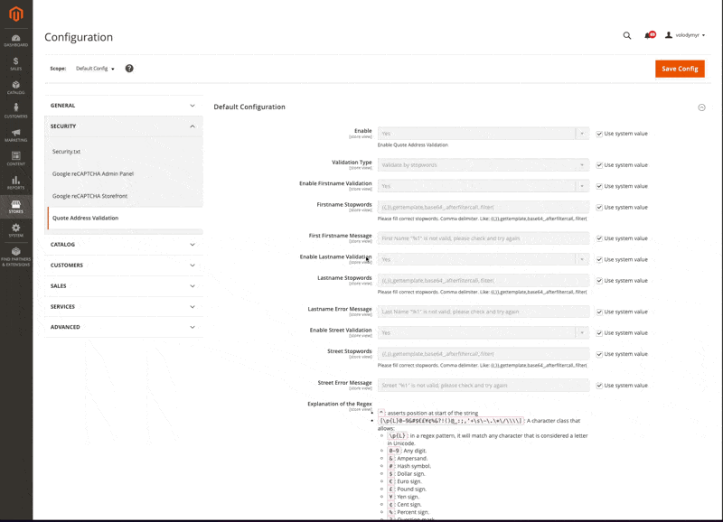

# Hryvinskyi_QuoteAddressValidator
[](https://packagist.org/packages/hryvinskyi/magento2-quote-address-validator) [](https://packagist.org/packages/hryvinskyi/magento2-quote-address-validator) [](https://packagist.org/packages/hryvinskyi/magento2-quote-address-validator) [](https://packagist.org/packages/hryvinskyi/magento2-quote-address-validator) [](https://packagist.org/packages/hryvinskyi/magento2-quote-address-validator)
[](https://scrutinizer-ci.com/g/hryvinskyi/magento2-quote-address-validator/?branch=master)

## Overview

The `Hryvinskyi_QuoteAddressValidator` module provides validation for quote addresses in Magento 2. It allows administrators to configure regex patterns and error messages for validating various address fields such as lastname and street.

## Installation

1. **Composer Installation:**
   ```bash
   composer require hryvinskyi/magento2-quote-address-validator
    ```
2. **Enable the Module:**
    ```bash
    php bin/magento module:enable Hryvinskyi_QuoteAddressValidator
    ```
3. **Clear Cache:**
    ```bash
    php bin/magento cache:clean
    ```
   
## Configuration

1. Navigate to `Stores > Configuration > Security > Quote Address Validator.`
2. Configure the following fields:
    - **Enable:** Set to `Yes` to enable the module.
    - **Validation Type:** Select the type of validation to apply to the address fields.
        - **`Validate by Regex`** - Validate the address fields using a regex pattern.
        - **`Validate by stopwords`** - Validate the address fields using a list of stopwords.
        - **`Validate by stopwords and regex`** - Validate the address fields using a list of stopwords and a regex pattern.
    - **Enable Firstname Validation** Set to `Yes` to enable validation for the firstname field.
    - **Firstname Stopwords** Enter a list of stopwords to validate the firstname field.
    - **Firstname Regex** Enter a regex pattern to validate the firstname field.
    - **Firstname Error Message** Enter an error message to display when the firstname field does not match the pattern.
    - **Enable Lastname Validation** Set to `Yes` to enable validation for the lastname field.
    - **Lastname Stopwords:** Enter a list of stopwords to validate the lastname field.
    - **Lastname Regex:** Enter a regex pattern to validate the lastname field.
    - **Lastname Error Message:** Enter an error message to display when the lastname field does not match the pattern.
    - **Enable Street Validation** Set to `Yes` to enable validation for the street field.
    - **Street Stopwords:** Enter a list of stopwords to validate the street field.
    - **Street Regex:** Enter a regex pattern to validate the street field.
    - **Street Error Message:** Enter an error message to display when the street field does not match the pattern.

## Command Line Interface

The module provides a command-line interface (CLI) to validate quote addresses. To use the CLI, run the following command:

```bash
php bin/magento hryvinskyi:quote-address-validator:check-existing-addresses
```

This command will validate all existing quote addresses and display any errors that are found.
This is useful for detecting country-specific errors in addresses and names and changing Regex patterns for validation.

<details>
<summary>Console Responce Example. Click to expand</summary>


</details>

## Example Regex Patterns

 - Firstname Regex: `/^([\p{L}0-9&#$€£¥¢%&?!()@_:;,'+\s\-\.\*\/\\\\]{1,50})$/u`
 - Lastname Regex: `/^([\p{L}0-9&#$€£¥¢%&?!()@_:;,'+\s\-\.\*\/\\\\]{1,50})$/u`
 - Street Regex: `/^([\p{L}0-9&#$€£¥¢%&?!()@_:;,'+\s\-\.\*\/\\\\]*)$/u`

## Explanation of Regex

- `^`: asserts position at start of the string
- `[\p{L}0-9&#$€£¥¢%&?!()@_:;,'+\s\-\.\*\/\\\\]`: A character class that allows:
    - `\p{L}`: in a regex pattern, it will match any character that is considered a letter in Unicode.
    - `0-9`: Any digit.
    - `&`: Ampersand.
    - `#`: Hash symbol.
    - `$`: Dollar sign.
    - `€`: Euro sign.
    - `£`: Pound sign.
    - `¥`: Yen sign.
    - `¢`: Cent sign.
    - `%`: Percent sign.
    - `?`: Question mark.
    - `!`: Exclamation mark.
    - `(`: Opening parenthesis.
    - `)`: Closing parenthesis.
    - `@`: At symbol.
    - `_`: Underscore.
    - `:`: Colon.
    - `;`: Semicolon.
    - `,`: Comma.
    - `'`: Apostrophe.
    - `+`: Plus sign.
    - `\s`: Any whitespace character (spaces, tabs, line breaks).
    - `\-`: Hyphen. (Note that the hyphen is escaped because it is a special character in regex.)
    - `\.`: Period. (Note that the dot is escaped because it is a special character in regex.)
    - `\*`: Asterisk. (Note that the asterisk is escaped because it is a special character in regex.)
    - `\/`: Forward slash. (Note that the slash is escaped because it is a special character in regex.)
    - `\\\\`: Backslash (the double backslash is necessary to escape the backslash itself in PHP strings and regex).
- `*`: Matches zero or more occurrences of the preceding element.
- `{1,50}`: Matches between 1 and 50 occurrences of the preceding element.
- `$`: asserts position at the end of the string.
- `u`: modifier: Treats the pattern as UTF-8, necessary for proper Unicode matching.

## Notes

Preference for `\Magento\Quote\Model\BillingAddressManagement` added only for correct error message display. (added `LocalizedException` catch to `assign` method)

## Demo Backend
<details>
<summary>Configuration</summary>


</details>


## Demo Frontend

<details>
<summary>Checkout shipping address validation</summary>


</details>


<details>
<summary>Checkout billing address validation</summary>


</details>

